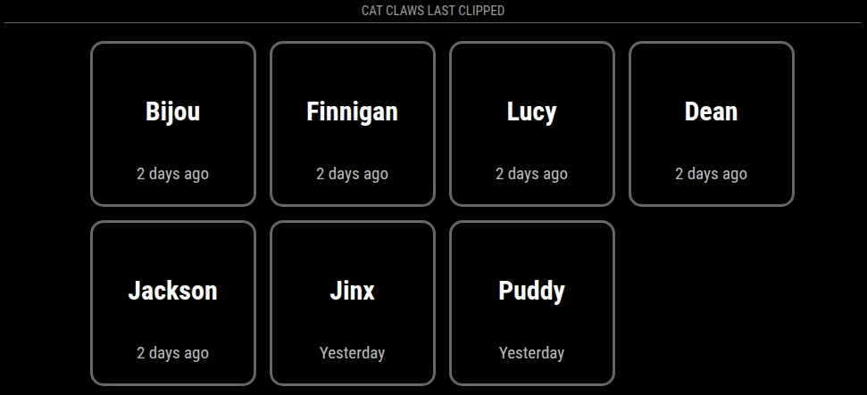

# MMM-CatClaws

A MagicMirror² module for tracking cat care tasks. Display clickable tiles for each of your cats to track when you last clipped their claws. Tiles show how many days ago each cat was last attended to, with overdue dates highlighted in red to help you stay on top of your feline care routine. Clicking on the tiles for a given cat resets their last updated date to today.



Because of the clickable tile functionality, this module is intended for touchscreen devices.

## Installation

1. Navigate to your MagicMirror's `modules` folder:
```bash
cd ~/MagicMirror/modules
```

2. Clone this repository:
```bash
git clone https://github.com/soapergem/MMM-CatClaws.git MMM-CatClaws
```

3. Navigate to the module folder and install dependencies:
```bash
cd MMM-CatClaws
npm install
```

## Configuration

Add the module to your MagicMirror's `config.js` file:

```javascript
{
    module: "MMM-CatClaws",
    position: "bottom_bar",
    header: "Cat Claws Last Clipped",
    config: {
        cats: ["Mittens", "Shadow", "Whiskers"],  // Array of cat names
        overdueDays: 8,  // Days before a date is considered overdue
        undoTimeout: 10000  // Time in ms to show undo option (0 to disable)
    }
}
```

## Configuration Options

| Option | Description | Default |
|--------|-------------|---------|
| `cats` | Array of cat names (strings) | `[]` (empty array) |
| `overdueDays` | Number of days before a date is considered overdue and displayed in red | `8` |
| `undoTimeout` | Time in milliseconds to show undo option after clicking a tile. Set to `0` to disable undo functionality. | `10000` (10 seconds) |

## License

MIT
